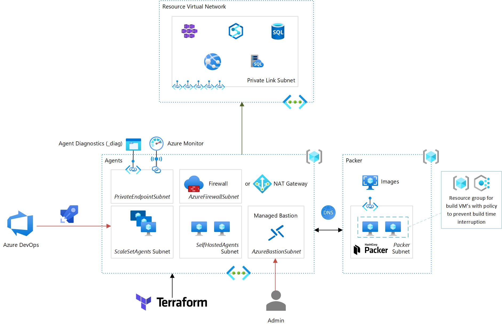

# Azure Pipeline Agents for Private Network Connectivity

[](https://dev.azure.com/ericvan/PipelineAgents/_build/latest?definitionId=135&branchName=master)

Azure Pipelines includes [Microsoft-hosted Agents](https://docs.microsoft.com/en-us/azure/devops/pipelines/agents/hosted?view=azure-devops&tabs=yaml) provided by the platform. If you can use these agents I recommend you do so as they provide a complete managed experience.

However, there may be scenarios where you need to manage your own agents:
- Private network access
- Configuration can't be met with any of the hosted agents (e.g. Linux distribution, Windows version)
- Improve build times by caching artifacts

The first point is probably the most common reason to set up your own agents. With the advent of Private Link it is more common to deploy Azure Services so that they can only be access from a virtual network. Hence you need an agent hosting model that fits that requirement. 

<p align="center">

</p>

## Self-hosted Agents
[Self-hosted Agents](https://docs.microsoft.com/en-us/azure/devops/pipelines/agents/v2-linux?view=azure-devops) are the predecessor to Scale Set Agents. They also provide the ability to run agents anywhere (including outside Azure). However, you have to manage the full lifecycle of each agent instance. I still include this approach as seperate Terraform modules for [Ubuntu](terraform/modules/self-hosted-linux-agent) & [Windows](terraform/modules/self-hosted-windows-agent). It involves installing the VM agent as described on this [page](https://docs.microsoft.com/en-us/azure/devops/pipelines/agents/v2-linux) for Linux. 

Set Terraform variable `use_self_hosted` to `true` to provision self-hosted agents. You will also need to set `devops_pat` and `devops_org`.

## Scale Set Agents
[Scale Set Agents](https://docs.microsoft.com/en-us/azure/devops/pipelines/agents/scale-set-agents?view=azure-devops) leverage Azure Virtual Machine Scale Sets. The lifecycle of individual agents is managed by Azure DevOps, therefore I recommend Scale Set Agents over Self-hosted agents. 

Set Terraform variable `use_scale_set` to `true` to provision scale set agents. 

The software in the scale set (I use Ubuntu only), is installed using [cloud-init](cloudinit/cloud-config-userdata.yaml). 

Note this also sets up some environment variables on the agent e.g. `GEEKZTER_AGENT_VIRTUAL_NETWORK_ID` that can be used in pipelines to set up a peering connection from (see example below).
## Infrastructure Provisioning
To customize provisioning, see [configuration](#configuration).
### Codespace
The easiest method is to use a GitHub [Codespace](https://github.com/features/codespaces). Just create a GitHub Codespace from the Code menu. This will create a Codespace with prerequisites installed. Wait until Codespace preparation including [post create commands](.devcontainer/createorupdate.ps1) have been completed to start a clean shell (pwsh). Follow the instructions shown to provision infrastructure.
### Local
#### Pre-requisites
If you set this up locally, make sure you have the following pre-requisites:
- [Azure CLI](http://aka.ms/azure-cli)
- [PowerShell](https://github.com/PowerShell/PowerShell#get-powershell)
- [Terraform](https://www.terraform.io/downloads.html) (to get that you can use [tfenv](https://github.com/tfutils/tfenv) on Linux & macOS, [Homebrew](https://github.com/hashicorp/homebrew-tap) on macOS or [chocolatey](https://chocolatey.org/packages/terraform) on Windows).

#### Interactive
Use the [Azure CLI](https://docs.microsoft.com/en-us/cli/azure/install-azure-cli?view=azure-cli-latest) to login:  
`az login`  
`az account set --subscription="SUBSCRIPTION_ID"`

This also [authenticates](https://www.terraform.io/docs/providers/azurerm/guides/azure_cli.html) the Terraform provider.
You can provision agents by running:  
`terraform init`  
`terraform apply`

#### Scripted
Alternatively, run:  
`./deploy.ps1 -Apply`

#### Pool
This will perform the  provision the agents. To create a pool from the scale set use the instructions provided [here](https://docs.microsoft.com/en-us/azure/devops/pipelines/agents/scale-set-agents?view=azure-devops#create-the-scale-set-agent-pool).
### From Pipeline
This repo contains a [pipeline](pipelines/azure-pipeline-agents-ci.yml) that can be used for CI/CD. You'll need the [Azure Pipelines Terraform Tasks](https://marketplace.visualstudio.com/items?itemName=charleszipp.azure-pipelines-tasks-terraform) extension installed.
To be able to create Self-Hosted Agents, the 'Project Collection Build Service (org)' group needs to be given 'Administrator' permission to the Agent Pool, and 'Limit job authorization scope to current project for non-release pipelines' disabled. For this reason, it is recommended to have a dedicated project for this pipeline.

## Configuration
Features toggles are declared in [`variables.tf`](./terraform/variables.tf) and can be overriden by creating a `.auto.tfvars` file (see [config.auto.tfvars.sample](terraform/config.auto.tfvars.sample)), or environemt variables e.g. `TF_VAR_use_self_hosted="true"`.
|Terraform variable|Feature|
|---|---|
|`configure_cidr_allow_rules`|Configure allow rules for IP ranges documented [here](https://docs.microsoft.com/en-us/azure/devops/organizations/security/allow-list-ip-url?view=azure-devops&tabs=IP-V4#ip-addresses-and-range-restrictions). When enabled traffic allowed by this rule will not have FQDN's shown in the logs|
|`configure_crl_oscp_rules`|Allow traffic to [TLS recommended locations](https://docs.microsoft.com/en-us/azure/security/fundamentals/tls-certificate-changes#will-this-change-affect-me). This is plain HTTP (port 80) traffic used by Certificate Revocation List (CRL) download and/or Online Certificate Status Protocol (OCSP).|
|`configure_wildcard_allow_rules`|Configure generic wildcard FQDN rules e.g. *.blob.core.windows.net|
|`create_contributor_service_principal`|Create Service Principal that can be used as Service Connection from the Azure DevOps portal|
|`deploy_bastion`|Deploy [managed bastion host](https://docs.microsoft.com/en-us/azure/bastion/)|
|`deploy_firewall`|Instead of [NAT Gateway](https://docs.microsoft.com/en-us/azure/virtual-network/nat-gateway/nat-overview), uses [Azure Firewall](https://docs.microsoft.com/en-us/azure/firewall/overview) for network egress traffic. This allows you to control outbound traffic e.g. by FQDN, as well as monitor it|
|`deploy_non_essential_vm_extensions`|Deploy monitoring extensions. These extensions generate their own network traffic. This variable allows you to turn them off. |
|`deploy_scale_set`|Deploy Scale Set agents|
|`deploy_self_hosted_vms`|Deploy Self-Hosted agent VMs|
|`deploy_self_hosted_vm_agents`|Deploy Self-Hosted agent VM extensions|
|`log_analytics_workspace_id`|Providing a value of an existing Log Analytics workspace allows you to retain logs after infrasructure is destroyed|
|`prepare_host`|Configure host image e.g. install packages (Ubuntu only) with [cloud-init](cloudinit)|

## Pipeline use
This yaml snippet shows how to reference the scale set pool and use the environment variables set by the agent:

```yaml
pool:
  name: 'Scale Set Agents 1' # Name of the Scale Set Agent Pool you created

steps:
- pwsh: |
    # Use pipeline agent virtual network as VNet to peer from
    $env:TF_VAR_peer_network_id = $env:GEEKZTER_AGENT_VIRTUAL_NETWORK_ID

    # Terraform will use $env:GEEKZTER_AGENT_VIRTUAL_NETWORK_ID as value for input variable 'peer_network_id' 
    # Create on-demand peering... (e.g. https://github.com/geekzter/azure-aks)
```

## Troubleshooting access
If you are using Azure Firewall, and find things are failing, you can monitor allowed & blocked traffic with Log Analytics queries e.g.
```kusto
AzureDiagnostics
| where Category == "AzureFirewallApplicationRule" or Category == "AzureFirewallNetworkRule"
| where msg_s contains "Deny"
| order by TimeGenerated desc
| project TimeGenerated, msg_s
```

For more elaborate queries, check the [kusto](kusto) directory.
