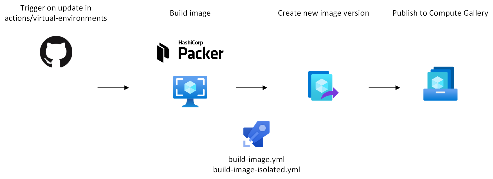

# Azure Pipeline Agents for Private Network Connectivity

[](https://dev.azure.com/ericvan/PipelineAgents/_build/latest?definitionId=135&branchName=master)
[](https://dev.azure.com/ericvan/PipelineAgents/_build/latest?definitionId=140&branchName=master)
[](https://dev.azure.com/ericvan/PipelineAgents/_build/latest?definitionId=134&repoName=geekzter%2Fazure-pipeline-agents&branchName=master)
[](https://dev.azure.com/ericvan/PipelineAgents/_build/latest?definitionId=138&repoName=geekzter%2Fazure-pipeline-agents&branchName=master)

Azure Pipelines includes [Microsoft-hosted Agents](https://docs.microsoft.com/en-us/azure/devops/pipelines/agents/hosted?view=azure-devops&tabs=yaml) as a managed service. If you can use these agents I recommend you do so as they provide the best managed experience.

However, there may be scenarios where you need to manage your own agents:
- Network access to your private resources e.g. [geekzter/azure-aks](https://github.com/geekzter/azure-aks)
- Configuration can't be met with any of the hosted agents (e.g. Linux distribution, Windows version)
- Improve build times by caching artifacts

The first point is probably the most common reason to set up your own agents. With the advent of [Private Link](https://docs.microsoft.com/en-us/azure/private-link/private-link-overview) it is more common to deploy Azure Services so that they can only be accessed from a virtual network. This requires an agent hosting model that fits that constraint. 

# Architecture
This repository contains Virtual Network integrated [Azure Pipeline scale set agents](https://docs.microsoft.com/en-us/azure/devops/pipelines/agents/scale-set-agents?view=azure-devops) and [self-hosted agents](https://docs.microsoft.com/en-us/azure/devops/pipelines/agents/v2-linux?view=azure-devops) that can build the VM images it itself uses. 

Azure services used include:
- Bastion
- Compute Gallery
- Firewall
- NAT Gateway 
- Pipelines
- Storage File Share
- Virtual Network 

Tools used are:
- Azure CLI 
- cloud-init
- Packer
- PowerShell
- Terraform

## Infrastructure
<p align="center">

</p>

This repo will provision an Azure Virtual Machine Scale Set in a Virtual Network. It will provision an egress device (Firewall or NAT Gateway) and remote access (Bastion). A choice can be made between a NAT Gateway (optimize cost) or Azure Firewall (optimize control) depending on the `deploy_azure_firewall` Terraform variable. This also impacts the extend to which resources are connected via Private Endpoints.

To enable Virtual Network integrated image builds with [build-image-isolated.yml](pipelines/build-image-isolated.yml), a separate Virtual Network (and resource group, optionally in a different subscription) to be used by Packer is created. For the image build VM's themselves yet another resource group is created. Policy is assigned to this resource group to prevent image build time VM extension installation which would render the image unusable (we want to install extensions at deploy time, not build time).

## Image lifecycle
<p align="center">

</p>      

The [build-image.yml](pipelines/build-images.yml) pipeline uses the [method and scripts described on the actions/runner-images GitHub repo](https://github.com/actions/runner-images/blob/main/docs/create-image-and-azure-resources.md) to build a managed image with the same configuration Azure DevOps and GitHub Actions are using for Microsoft-hosted agents and GitHub-hosted runners. The [GenerateResourcesAndImage.ps1](https://github.com/actions/runner-images/blob/main/helpers/GenerateResourcesAndImage.ps1) script does the heavy lifting of building the managed image with Packer. This pipeline can run on Microsoft-hosted agents ('Azure Pipelines' pool). 

In Enterprise you will have isolation requirements (e.g. no public endpoints), build in a Virtual Network, protect the identity used for the build, etc. To accommodate such requirements the [build-image-isolated.yml](pipelines/build-image-isolated.yml) takes the [packer templates](https://github.com/actions/runner-images/tree/main/images/linux) and provides the variables required to customize the VM that is used to create the image from. This pipeline needs to run on a self-hosted agent such as the scale set agents deployed by this repository.

### Licensing
Note that by building an image **you are accepting licenses** pertaining to the tools installed **at software installation (i.e. build) time**.

## Agent lifecycle
<p align="center">

</p>     

With the aforementioned image template created by [actions/runner-images](https://github.com/actions/runner-images/), or an Azure Marketplace image, you can make sure you're always on the latest version. Instead of post deployment patching, an immutable infrastructure approach is taken when new versions of the image are built instead of patching VM's.

Lifecycle steps are:
- A Virtual Machine Scale Set (VMSS) is created with the (at that time) latest version of an image
- Adding the VMSS has a [scale set agent pool](https://docs.microsoft.com/en-us/azure/devops/pipelines/agents/scale-set-agents?view=azure-devops) ensures the Azure Pipelines agent is installed
- When a pipeline job needs to be run, a VMMS instance is assigned to run the job
- When the pipeline completes, the VMSS instance is destroyed
- When Virtual Machine Scale Set needs a new instance, an instance is created from the latest VM image version   

The above ensures VM instances are kept up to date. The speed of this is controlled by the minimum and maximum number of instances if the scale set agents pool (as configured in Azure DevOps).

# Infrastructure Provisioning
To customize provisioning, see [configuration](#configuration).
## Provision with Codespace
The easiest method is to use a GitHub [Codespace](https://github.com/features/codespaces). Just create a GitHub Codespace from the Code menu or [page](../../codespaces). This will create a Codespace with prerequisites installed. Wait until Codespace preparation including [post create commands](.devcontainer/createorupdate.ps1) have been completed to start a clean shell (pwsh).    
If your prompt looks like this, post creation has not yet finished:    
`PS /workspaces/azure-pipeline-agents>`   
Instead a terminal should look like:    
`/workspaces/azure-pipeline-agents/scripts [master ≡]>`   
Follow the instructions shown in the terminal to provision infrastructure.
### Environment variables
If you fork this repository on GitHub, you can define [Codescape secrets](https://docs.github.com/en/codespaces/managing-your-codespaces/managing-encrypted-secrets-for-your-codespaces). These will be surfaced as environment variables with the same name. Defining secrets for `ARM_TENANT_ID` and `ARM_SUBSCRIPTION_ID` will make sure you target the right Azure subscription.

### Session Management
You can reconnect to disconnected terminal sessions using [tmux](https://github.com/tmux/tmux/wiki). This [blog post](https://geekzter.medium.com/session-management-for-cloud-shell-and-codespaces-29f474925c53) explains how that works. Just type    
`ct <terraform workspace>`   
to enter a tmux session with the terraform workspace environment variable `TF_WORKSPACE` set. Type the same to get back into a previously disconnected session. This can be done up to the timeout [configured](https://docs.github.com/en/codespaces/customizing-your-codespace/setting-your-timeout-period-for-codespaces) in Codespaces.
## Provision locally
### Pre-requisites
If you set this up locally, make sure you have the following pre-requisites:
- [Azure CLI](http://aka.ms/azure-cli)
- [PowerShell](https://github.com/PowerShell/PowerShell#get-powershell)
- [Terraform](https://www.terraform.io/downloads.html) (to get that you can use [tfenv](https://github.com/tfutils/tfenv) on Linux & macOS, [Homebrew](https://github.com/hashicorp/homebrew-tap) on macOS or [chocolatey](https://chocolatey.org/packages/terraform) on Windows).

### Interactive
Run:  
`scripts/deploy.ps1 -Apply`   
This will also log into Azure and let you select a subscription in case `ARM_SUBSCRIPTION_ID` is not set.

## Provision from Pipeline
This repo contains a [pipeline](pipelines/azure-pipeline-agents-ci.yml) that can be used for CI/CD. You'll need the [Azure Pipelines Terraform Tasks](https://marketplace.visualstudio.com/items?itemName=charleszipp.azure-pipelines-tasks-terraform) extension installed.
To be able to create Self-Hosted Agents, the 'Project Collection Build Service (org)' group needs to be given 'Administrator' permission to the Agent Pool, and 'Limit job authorization scope to current project for non-release pipelines' disabled. For this reason, it is recommended to have a dedicated project for this pipeline.

# Configuration

## Self-hosted Agents
[Self-hosted Agents](https://docs.microsoft.com/en-us/azure/devops/pipelines/agents/v2-linux?view=azure-devops) are the predecessor to Scale Set Agents. They also provide the ability to run agents anywhere (including outside Azure). However, you have to manage the full lifecycle of each agent instance. I still include this approach as separate Terraform modules for [Ubuntu](terraform/modules/azure-self-hosted-linux-agent) & [Windows](terraform/modules/azure-self-hosted-windows-agent). It involves installing the VM agent as described on this [page](https://docs.microsoft.com/en-us/azure/devops/pipelines/agents/v2-linux) for Linux. 

Set Terraform variable `deploy_self_hosted` to `true` to provision self-hosted agents. You will also need to set `azdo_pat` and `azdo_org`.

## Scale Set Agents
[Scale Set Agents](https://docs.microsoft.com/en-us/azure/devops/pipelines/agents/scale-set-agents?view=azure-devops) leverage Azure Virtual Machine Scale Sets. The lifecycle of individual agents is managed by Azure DevOps, therefore I recommend Scale Set Agents over Self-hosted agents. 

Set Terraform variable `deploy_azure_scale_set` to `true` to provision scale set agents. 

The software in the scale set (I use Ubuntu only), is installed using [cloud-init](cloudinit/cloud-config-userdata.yaml). 

Note this also sets up some environment variables on the agent e.g. `PIPELINE_DEMO_AGENT_VIRTUAL_NETWORK_ID` that can be used in pipelines to set up a peering connection from (see example below).

## Feature toggles
Features toggles are declared in [`variables.tf`](./terraform/variables.tf) and can be overridden by creating a `.auto.tfvars` file (see [config.auto.tfvars.sample](terraform/config.auto.tfvars.sample)), or environemt variables e.g. `TF_VAR_deploy_self_hosted="true"`.
|Terraform variable|Feature|
|---|---|
|`configure_azure_cidr_allow_rules`|Configure allow rules for IP ranges documented [here](https://docs.microsoft.com/en-us/azure/devops/organizations/security/allow-list-ip-url?view=azure-devops&tabs=IP-V4#ip-addresses-and-range-restrictions). When enabled traffic allowed by this rule will not have FQDN's shown in the logs.|
|`configure_azure_crl_oscp_rules`|Allow traffic to [TLS recommended locations](https://docs.microsoft.com/en-us/azure/security/fundamentals/tls-certificate-changes#will-this-change-affect-me). This is plain HTTP (port 80) traffic used by Certificate Revocation List (CRL) download and/or Online Certificate Status Protocol (OCSP).|
|`configure_azure_wildcard_allow_rules`|Configure generic wildcard FQDN rules e.g. *.blob.core.windows.net.|
|`deploy_azure_bastion`|Deploy [managed bastion host](https://docs.microsoft.com/en-us/azure/bastion/).|
|`deploy_azure_files_share`|Deploy [SMB files share](https://docs.microsoft.com/en-us/azure/storage/files/files-smb-protocol?tabs=azure-portal), mount it on agents and configure Pipeline Agent diagnostics (_diag directory) to use it.|
|`deploy_azure_firewall`|Instead of [NAT Gateway](https://docs.microsoft.com/en-us/azure/virtual-network/nat-gateway/nat-overview), uses [Azure Firewall](https://docs.microsoft.com/en-us/azure/firewall/overview) for network egress traffic. This allows you to control outbound traffic e.g. by FQDN, as well as monitor it. Setting this value to `true` will also create private endpoints for storage used, Azure Monitor, etc.|
|`deploy_non_essential_azure_vm_extensions`|Deploy monitoring extensions. These extensions generate their own network traffic. This variable allows you to turn them off. |
|`deploy_azure_scale_set`|Deploy Scale Set agents.|
|`deploy_azure_self_hosted_vms`|Deploy Self-Hosted agent VMs.|
|`deploy_azdo_self_hosted_vm_agents`|Deploy Self-Hosted agent VM extensions.|
|`linux_tools`|Uses [cloud-init](https://cloudinit.readthedocs.io/) to instal tools (e.g. AzCopy, Packer, PowerShell, PowerShell Azure modules). Should not be used when using a pre-baked image.|
|`azure_linux_os_image_id`|Use pre-baked image by specifying the resource id of a VM image e.g. /subscriptions/00000000-0000-0000-0000-000000000000/resourceGroups/Shared/providers/Microsoft.Compute/galleries/SharedImages/images/Ubuntu2204/versions/latest|
|`azure_log_analytics_workspace_id`|Providing a value of an existing Log Analytics workspace allows you to retain logs after infrastructure is destroyed.|
|`azure_windows_os_image_id`|Use pre-baked image by specifying the resource id of a VM image e.g. /subscriptions/00000000-0000-0000-0000-000000000000/resourceGroups/Shared/providers/Microsoft.Compute/galleries/SharedImages/images/Windows2025/versions/latest|

## Pipeline use
This yaml snippet shows how to reference the scale set pool and use the environment variables set by the agent:

```yaml
pool:
  name: 'Scale Set Agents 1' # Name of the Scale Set Agent Pool you created

steps:
- pwsh: |
    # Use pipeline agent virtual network as VNet to peer from
    $env:TF_VAR_peer_network_id = $env:PIPELINE_DEMO_AGENT_VIRTUAL_NETWORK_ID

    # Terraform will use $env:PIPELINE_DEMO_AGENT_VIRTUAL_NETWORK_ID as value for input variable 'peer_network_id' 
    # Create on-demand peering... (e.g. https://github.com/geekzter/azure-aks)
```

## Troubleshooting access
If you are using Azure Firewall, and find things are failing, you can monitor allowed & blocked traffic with Log Analytics queries e.g.
```kusto
AzureDiagnostics
| where Category == "AzureFirewallApplicationRule" or Category == "AzureFirewallNetworkRule"
| where msg_s contains "Deny"
| order by TimeGenerated desc
| project TimeGenerated, msg_s
```

For more elaborate queries, check the [kusto](kusto) directory.
